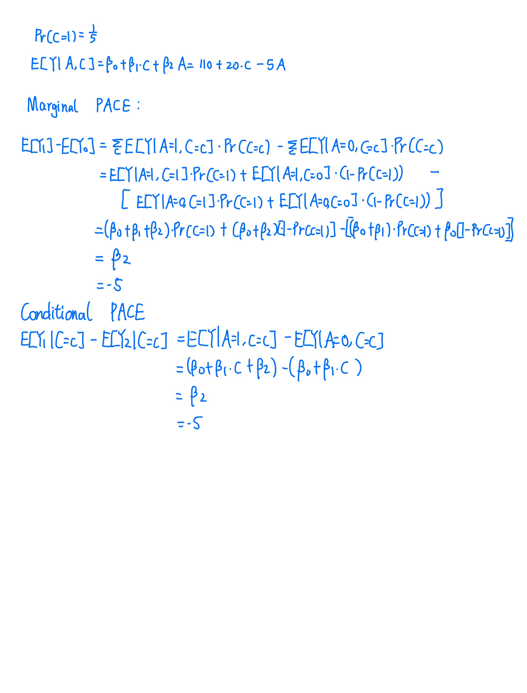
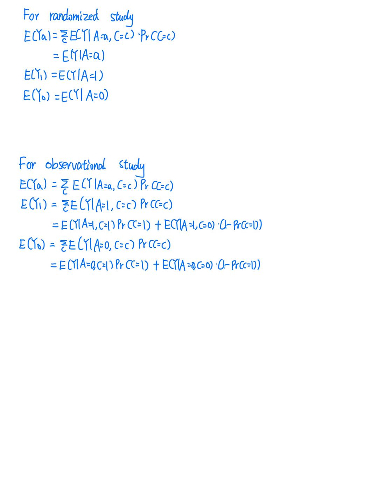
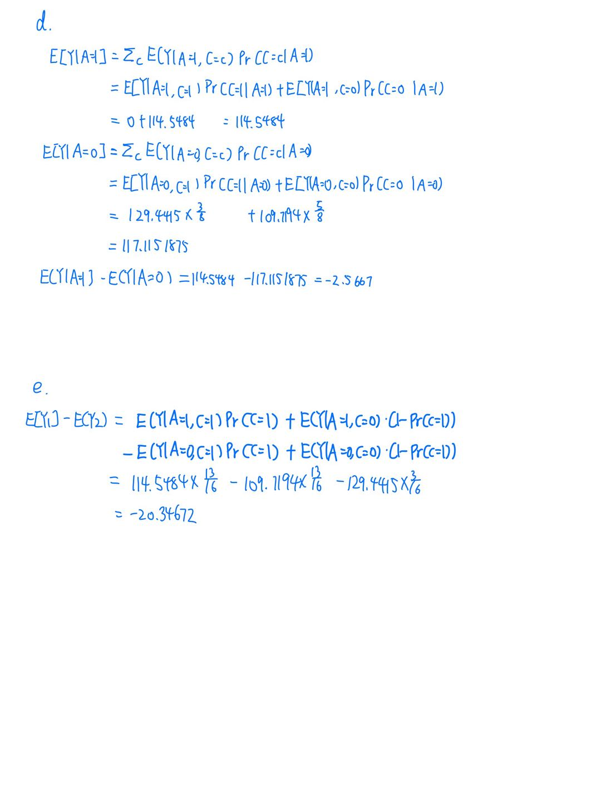

```{r setup, include=FALSE}
library(tidyverse)
knitr::opts_chunk$set(echo = TRUE,
                      warning = FALSE,
                      message = FALSE)
```

```{r}
# data import
set.seed(124)
n <- 16
p_C <- 1/5
C <- rbinom(n,1,p_C)
theta0 <- 1/2
theta1 <- -1/5
p_A <- theta0+theta1*C
A <- rbinom(n,1,p_A)
beta0 <- 110
beta1 <- 20
beta2 <- 5
sigma_Y <- 1
mu_Y <- beta0+beta1*C+beta2*A
Y <- rnorm(n,mu_Y, sigma_Y)
```

# Question a

p: The baseline covariate C (obesity) follows Bernoulli distribution. p is the probability of C taking 1 (with obesity).

theta0: The probability of assigning the units to treatment group (light) if the units are not with obesity (C = 0).

theta1: The probability of assigning the units with obesity to treatment group (light) is 1/5 times lower than the units without obesity on average.

beta0: The mean of baseline glucose when the mice are non-obese and unexposed to light.

beta1: Intervening to increase C (obesity) by one unit will, on average, increase the outcome Y (glucose) by 20 units, holding other	conditions	to	be	the	same.	

beta2: Intervening to increase A (light) by one unit will, on average, decrease the outcome Y (glucose) by 5 units, holding other	conditions	to	be	the	same.	

# Question b

```{r echo=FALSE}

```


### Marginal PACE
We can identify marginal PACE when there is no backdoor path (randomized experiments). 

The marginal PACE is counterfactual. We assume the expectation if the whole population is assigned to treatment or control group.


### Conditional PACE
We can identify conditional PACE when there is no unobserved confounding (for observational experiment).

The conditional PACE is conditional on specific level of covariate. It’s not across the population.


# Question c

```{r echo=FALSE}

```


For the *randomized study*, we assume that there are no confounders thus we can conclude the g-formula as above (without covariate C).

For the *observational study*, we assume that there is a confounder which will affect the assignment, thus we need to calculate the expectation conditional on the covariate C.


# Question d

```{r}
mice_df = cbind(Y, A, C)%>%
  as.data.frame()
```

```{r}
EYA1_1=mean(mice_df[which(mice_df$A == 1 & C == 1), ]$Y)
EYA1_1
EYA1_0=mean(mice_df[which(mice_df$A == 1 & C == 0), ]$Y)
EYA1_0
EYA0_1=mean(mice_df[which(mice_df$A == 0 & C == 1), ]$Y)
EYA0_1
EYA0_0=mean(mice_df[which(mice_df$A == 0 & C == 0), ]$Y)
EYA0_0
```

```{r echo=FALSE}

```

In this question, we consider about the crude mean. This formula shows the association other than causal effect.  

On average, the the treatment group will have a value of outcome Y which is 2.5667 units lower.


# Question e


```{r echo=FALSE}

```

In this question, we calculate the marginal ACE using g-formula. In this situation, covariate C is included and this formula shows the causal effect.

If we assign the population to the treatment group (A=1) and the control group (A=0) conditional on the covariate C, then, on average, the the treatment group will have a value of outcome Y which is 20.34672 units lower.


#### The differences between the inferences obtained in (d) and (e):

* In question d, the covariate C is not included and we assume a randomized assignment. But in question e, the covariate C is included and we assume an assignment based on covariate.

* The formula in question d tells us about the association, but the formula in question e tells us about the casual effect.


# Question f

* The linear regression to be correctly specified.

* All confounders are included in the new covariates.


